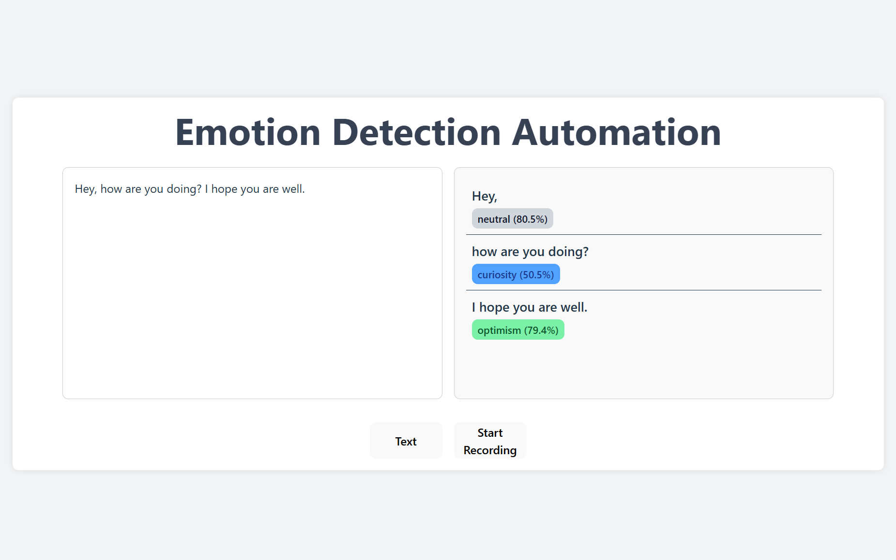
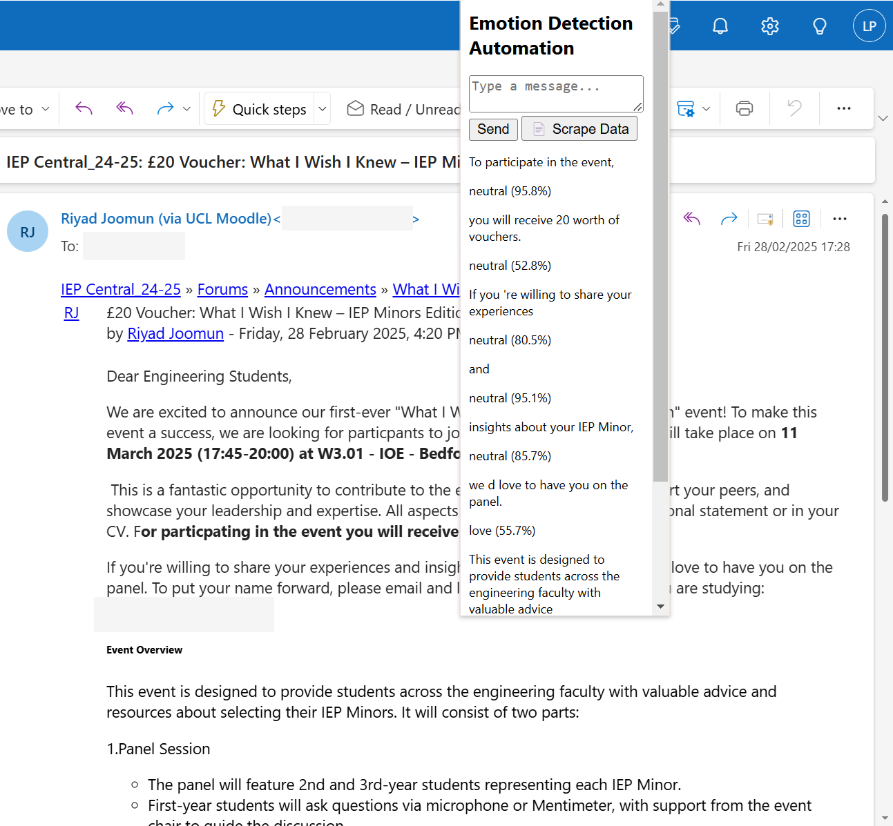

# Emotion Detection Automation

https://www.youtube.com/watch?v=TfNnpsYATbQ&ab_channel=Qash

This project  was created for [HackLondon 2025](https://www.huzzle.app/events/hacklondon-2025-884200), a UCL x KCL hackathon.


# Website



## Features
- Text input
- Voice input
- Corrects spelling mistakes in input text
- Splits input into different tokens, based on English language rules
- Displays the corrected text, with the sentiment and the certainty of the model (useful for ambiguous statements)

# Chrome Extension




## Features
- Text input
- Scraping the contents of an Outlook email
- The rest the same as above.

## Tools/ Technologies

* React website with Python server, current using uvicorn for local hosting the python, and npm for the server.
* REST Api on the server with FastApi python library

Chains some local AI models depending on the mode:
* ```WHISPER``` for speech-to-text
* ```T5Tokenizer``` and ```spacy`` for tokenisation of text
* ```T5ForConditionalGeneration``` for spelling correction
* ```bhadresh-savani/bert-base-go-emotion``` for emotion detection